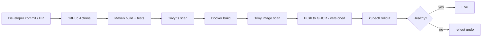
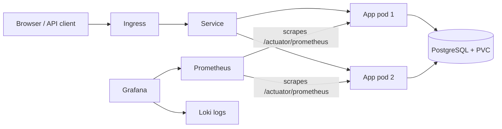

# Architecture & DevOps Flow

## Pipeline


## Runtime


## Repository layout
```
src/main/java/...        controllers, services, repositories, entities, security config
src/main/resources       application.yml, static web UI
src/test/java/...        unit (Mockito) + integration (MockMvc) tests
Dockerfile               multi-stage, layered, non-root
docker-compose.yml       local full stack with monitoring + logging
.github/workflows        CI/CD pipeline
Jenkinsfile              alternative pipeline
k8s/                     Kubernetes manifests
monitoring/              Prometheus, Grafana dashboards/datasources, Promtail config
scripts/                 local K8s deploy, rollback
```

## Data model
- **Event**(id, title, description, venue, eventDate, capacity, createdBy)
- **Registration**(id, event_id, username, status, attended, attendedAt, registeredAt) — unique(event, username)

## Rolling-update vs blue-green
The Deployment uses `RollingUpdate` with `maxUnavailable: 0` (zero downtime). Rollback is a single command.
